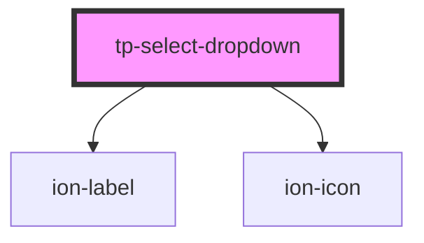

# tp-select-dropdown

<!-- Auto Generated Below -->

## Properties

| Property            | Attribute     | Description                                          | Type                       | Default     |
| ------------------- | ------------- | ---------------------------------------------------- | -------------------------- | ----------- |
| `color`             | `color`       | Define a variação de cor do componente.              | `string \| undefined`      | `undefined` |
| `name` _(required)_ | `name`        | Define o nome do componente, agrupando as opções.    | `string`                   | `undefined` |
| `numeric`           | `numeric`     | Define se o componente representa valores numéricos. | `boolean`                  | `false`     |
| `options`           | --            | Define as opções de seleção do componente.           | `TpSelectDropdownOption[]` | `[]`        |
| `placeholder`       | `placeholder` | Define o placeholder do componente.                  | `string \| undefined`      | `undefined` |
| `value`             | `value`       | Define o valor do componente.                        | `null \| number \| string` | `null`      |

## Events

| Event         | Description                                              | Type                            |
| ------------- | -------------------------------------------------------- | ------------------------------- |
| `valueChange` | Evento emitido quando há mudança no valor do componente. | `CustomEvent<number \| string>` |

## CSS Custom Properties

| Name                    | Description                                                                |
| ----------------------- | -------------------------------------------------------------------------- |
| `--dropdown-max-height` | Define a altura máxima do dropdown. Default: 220px (igual select-popover). |

## Dependencies

### Depends on

- [ion-label](../../../label)
- ion-icon

### Graph

----------------------------------------------

*Built with [StencilJS](https://stenciljs.com/)*
